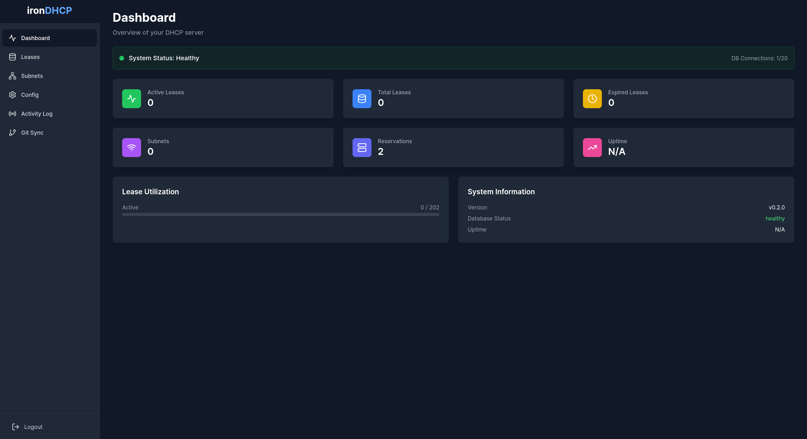
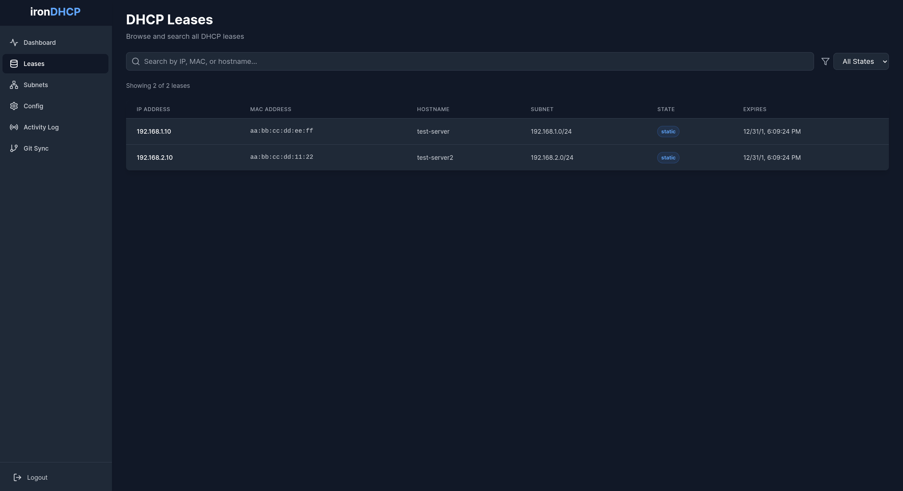
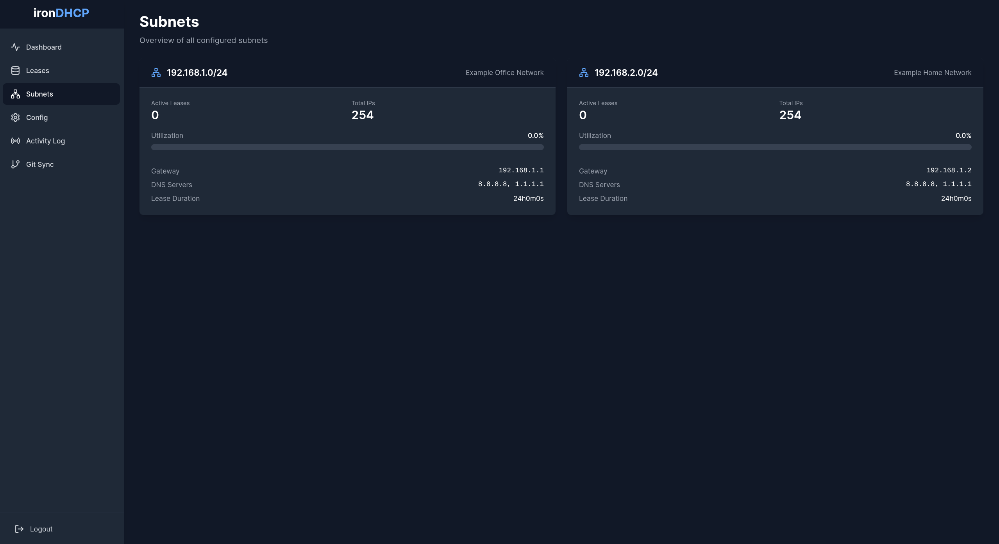
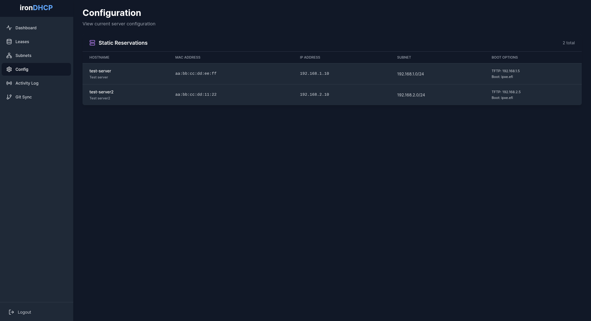
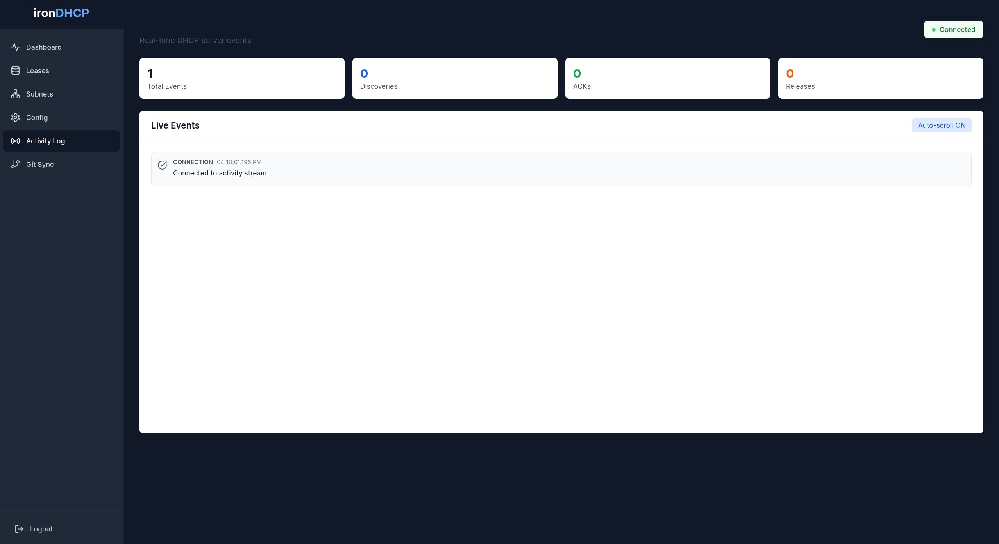
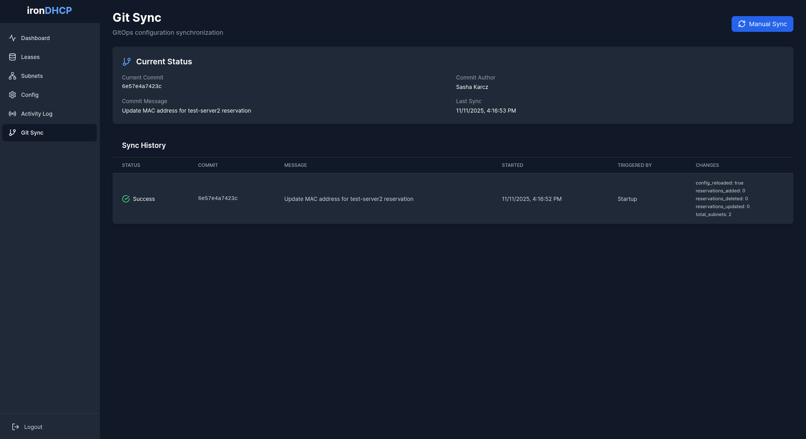

# ironDHCP

A modern, production-ready DHCP server written in Go with GitOps-first configuration and embedded web interface.

Version 1.0.0

## Overview

ironDHCP is a high-performance DHCP server designed for modern infrastructure with GitOps integration, real-time observability, and a built-in web UI. Everything runs in a single binary with no external dependencies except PostgreSQL.

## Key Features

### Core DHCP
- RFC 2131/2132 compliant DHCP implementation
- LRU-based IP allocation with 10,000-entry in-memory cache
- Static MAC-to-IP reservations
- Multiple subnet support with per-subnet configuration
- PXE/iPXE network boot support (options 66, 67)
- High availability with shared PostgreSQL backend

### GitOps Integration
- Git repository polling and automatic sync
- Configuration validation before apply
- Atomic configuration reload with zero downtime
- Complete audit trail in PostgreSQL
- Manual sync trigger via API and web UI
- Support for SSH and HTTPS Git authentication

### Web Interface
- Modern React SPA with dark theme
- Mobile-responsive design with hamburger menu
- Real-time dashboard with statistics
- Lease browser with search and filtering
- Subnet overview with utilization metrics
- Live activity log with Server-Sent Events
- Git sync status and history
- Bearer token authentication
- Fully embedded in single binary (no external files)

### Observability
- Prometheus metrics endpoint
- Structured JSON logging with zerolog
- Real-time activity stream via SSE
- Git sync audit log with full history
- Automatic lease expiry worker

## Architecture

- **Language**: Go 1.23+
- **Database**: PostgreSQL 12+ with pgx/v5 driver
- **DHCP**: github.com/insomniacslk/dhcp v4
- **Git**: go-git for repository operations
- **Logging**: zerolog (structured JSON)
- **Metrics**: Prometheus client
- **Frontend**: React 18 + TypeScript + Vite + Tailwind CSS
- **Deployment**: Single binary with embedded web UI and SQL migrations (only config.yaml required)

### Embedded Architecture

ironDHCP uses Go's `embed` directive to bundle all static assets into the compiled binary:

- **Web UI**: Frontend built with Vite is embedded via `//go:embed all:dist` in `internal/api/handlers.go`
- **SQL Migrations**: Database migration files are embedded via `//go:embed migrations/*.sql` in `internal/storage/init.go`
- **No External Files**: The binary contains everything needed except the configuration file

This means you can deploy ironDHCP with just two files:
1. The `irondhcp` binary
2. Your `config.yaml`

All web assets, JavaScript, CSS, and database migrations are compiled into the binary at build time.

## Quick Start

### Prerequisites

- Go 1.23+
- PostgreSQL 12+
- Node.js 18+ (for building frontend)
- Docker and Docker Compose (optional, for dev database)

### Development Setup

1. Clone the repository:
```bash
git clone https://github.com/sashakarcz/irondhcp.git
cd irondhcp
```

2. Start PostgreSQL (using Docker):
```bash
make dev-db
```

This starts PostgreSQL on localhost:5432 with:
- Database: godhcp
- User: dhcp
- Password: dhcp_dev_password

3. Build the project:
```bash
make build-all
```

This will:
- Install npm dependencies
- Build the React frontend
- Embed frontend in Go binary
- Compile the irondhcp binary

4. Run the server:
```bash
sudo ./bin/irondhcp --config example-config.yaml
```

Note: DHCP requires root privileges or CAP_NET_RAW capability to bind to port 67.

5. Access the web UI:
```
http://localhost:8080
```

Default credentials (if web_auth is enabled):
- Username: admin
- Password: admin

### Testing Without DHCP

For testing the web UI without root privileges:
```bash
./bin/irondhcp --config example-config.yaml
```

The API server will start on port 8080 even if DHCP binding fails.

## Configuration

### Basic Configuration

Create a YAML configuration file (example: `config.yaml`):

```yaml
interfaces:
  - eth0

database:
  host: localhost
  port: 5432
  database: godhcp
  user: dhcp
  password: dhcp_dev_password
  ssl_mode: disable
  max_connections: 10

subnets:
  - network: 192.168.1.0/24
    range_start: 192.168.1.100
    range_end: 192.168.1.200
    lease_duration: 24h
    options:
      router: 192.168.1.1
      dns_servers:
        - 8.8.8.8
        - 8.8.4.4
      domain_name: example.com

reservations:
  - mac: "00:11:22:33:44:55"
    ip: 192.168.1.50
    hostname: server1
    description: "Production web server"

api:
  enabled: true
  listen_address: ":8080"
  metrics_path: "/metrics"

web_auth:
  enabled: true
  username: admin
  password_hash: "8c6976e5b5410415bde908bd4dee15dfb167a9c873fc4bb8a81f6f2ab448a918"  # SHA-256 of "admin"

logging:
  level: info
  format: json

git:
  enabled: false
  repository_url: "https://github.com/example/dhcp-config.git"
  branch: main
  config_path: "config.yaml"
  poll_interval: 5m
  ssh_key_path: ""
  ssh_key_password: ""
```

### GitOps Configuration

To enable GitOps mode:

1. Create a Git repository for your DHCP configuration
2. Add your `config.yaml` to the repository
3. Enable Git sync in your config:

```yaml
git:
  enabled: true
  repository_url: "git@github.com:yourorg/dhcp-config.git"
  branch: main
  config_path: "config.yaml"
  poll_interval: 5m
  ssh_key_path: "/path/to/ssh/key"
  ssh_key_password: ""
```

For HTTPS with token:
```yaml
git:
  repository_url: "https://token@github.com/yourorg/dhcp-config.git"
```

### PXE Boot Configuration

Enable PXE/iPXE network boot:

```yaml
subnets:
  - network: 192.168.1.0/24
    range_start: 192.168.1.100
    range_end: 192.168.1.200
    options:
      router: 192.168.1.1
      dns_servers: ["8.8.8.8"]
      tftp_server: 192.168.1.10
      boot_filename: "pxelinux.0"

reservations:
  - mac: "aa:bb:cc:dd:ee:ff"
    ip: 192.168.1.100
    hostname: pxe-client
    tftp_server: 192.168.1.10
    boot_filename: "custom-boot.ipxe"
```

Per-host settings override subnet defaults.

### Web Authentication

Generate a password hash:
```bash
make hashpw mypassword
```

Output:
```
Password: mypassword
SHA-256 Hash: 89e01536ac207279409d4de1e5253e01f4a1769e696db0d6062ca9b8f56767c8

Add this to your config:
  web_auth:
    enabled: true
    username: admin
    password_hash: "89e01536ac207279409d4de1e5253e01f4a1769e696db0d6062ca9b8f56767c8"
```

Disable authentication (development only):
```yaml
web_auth:
  enabled: false
```

## Usage

### Running the Server

Standard mode:
```bash
sudo ./bin/irondhcp --config config.yaml
```

With custom database:
```bash
sudo ./bin/irondhcp --config config.yaml \
  --db-host postgres.example.com \
  --db-port 5432 \
  --db-name dhcp \
  --db-user dhcp_user \
  --db-password secret
```

### Web UI

Access the web interface at `http://localhost:8080` (or your configured API address).

The web UI is a modern, mobile-responsive React application with a dark theme, embedded directly in the binary. Features a collapsible sidebar navigation on mobile devices with smooth animations.

#### Dashboard

Real-time statistics and system overview:
- Total leases (active + expired)
- Active lease count
- Expired lease count
- Total subnets configured
- Static reservations count
- System uptime



#### Leases

Browse all DHCP leases (dynamic and static) with search and filtering:
- Search by IP address, MAC address, or hostname
- Filter by lease state (active, expired, released, static)
- Filter by subnet
- Sort by any column
- Real-time updates

**Lease States:**
- **Static**: Permanent MAC-to-IP reservation
- **Active**: Currently active lease
- **Expired**: Lease has expired
- **Released**: Client released the lease



#### Subnets

View subnet configuration and utilization metrics:
- Network CIDR
- Gateway and DNS servers
- Lease duration
- Active leases vs total IPs
- Utilization percentage with visual progress bar



#### Reservations

View and manage static MAC-to-IP reservations:
- MAC address and reserved IP
- Hostname and description
- PXE boot configuration (TFTP server, boot filename)
- When GitOps is enabled, managed via Git



#### Activity Log

Real-time activity stream showing DHCP events as they occur:
- Live updates via Server-Sent Events (SSE)
- Color-coded event types
- Detailed event information
- Auto-scroll to latest events



#### Git Sync (GitOps)

View Git repository status and sync history:
- Current commit information
- Last sync timestamp and status
- Sync history with commit details
- Manual sync trigger button
- Changes applied per sync



**Features:**
- Fully responsive design with mobile-optimized layout
- Hamburger menu navigation on mobile devices
- Dark theme optimized for readability
- Real-time updates without page refresh
- Filter, search, and sort capabilities
- Bearer token authentication with 24-hour sessions
- Embedded in single binary with no external dependencies

### REST API

Complete REST API for programmatic access and automation.

**Quick Example:**
```bash
# Login
TOKEN=$(curl -s -X POST http://localhost:8080/api/v1/login \
  -H "Content-Type: application/json" \
  -d '{"username":"admin","password":"admin"}' | jq -r '.token')

# Get dashboard stats
curl -H "Authorization: Bearer $TOKEN" \
  http://localhost:8080/api/v1/dashboard/stats

# List active leases
curl -H "Authorization: Bearer $TOKEN" \
  http://localhost:8080/api/v1/leases

# Trigger Git sync
curl -X POST -H "Authorization: Bearer $TOKEN" \
  -H "Content-Type: application/json" \
  http://localhost:8080/api/v1/git/sync \
  -d '{"triggered_by":"automation"}'
```

**Available Endpoints:**
- `POST /api/v1/login` - Authenticate and get bearer token
- `GET /api/v1/health` - Health check (no auth required)
- `GET /api/v1/dashboard/stats` - Dashboard statistics
- `GET /api/v1/leases` - List all DHCP leases
- `GET /api/v1/subnets` - List subnets with utilization
- `GET /api/v1/reservations` - List static reservations
- `GET /api/v1/git/status` - Git repository status
- `GET /api/v1/git/logs` - Git sync operation history
- `POST /api/v1/git/sync` - Trigger manual Git sync
- `GET /api/v1/activity/stream` - Real-time activity stream (SSE)

**Full Documentation:**
- [API.md](./API.md) - Complete API reference with request/response examples, data models, and error codes
- [API-QUICKREF.md](./API-QUICKREF.md) - Quick reference card for common operations and automation examples

### Prometheus Metrics

Access metrics at:
```
http://localhost:8080/metrics
```

Available metrics:
- `irondhcp_dhcp_requests_total` - Counter of DHCP requests by type (discover, request, release, inform)
- `irondhcp_dhcp_responses_total` - Counter of DHCP responses by type (offer, ack, nak)
- `irondhcp_active_leases` - Gauge of currently active leases
- `irondhcp_git_syncs_total` - Counter of Git sync operations by status (success, failed)
- `irondhcp_git_sync_duration_seconds` - Histogram of Git sync operation duration

Example Prometheus scrape config:
```yaml
scrape_configs:
  - job_name: 'irondhcp'
    static_configs:
      - targets: ['localhost:8080']
```

## Development

### Project Structure

```
irondhcp/
├── cmd/
│   ├── godhcp/          # Main application entry point
│   └── hashpw/          # Password hashing utility
├── internal/
│   ├── api/             # REST API and web server (embedded web UI)
│   ├── config/          # Configuration parsing
│   ├── dhcp/            # DHCP server and handlers
│   ├── events/          # SSE event broadcaster
│   ├── gitops/          # Git repository and sync logic
│   ├── logger/          # Structured logging setup
│   ├── metrics/         # Prometheus metrics
│   └── storage/         # PostgreSQL data layer (embedded migrations)
│       └── migrations/  # SQL migration files (embedded in binary)
├── web/                 # React frontend source
│   ├── src/
│   │   ├── api/        # API client
│   │   ├── components/ # React components
│   │   ├── pages/      # Page components
│   │   └── types/      # TypeScript types
│   └── dist/           # Built frontend (git-ignored, embedded in binary)
├── deployments/
│   └── docker/         # Docker Compose for development
├── Makefile            # Build automation
└── config.yaml         # Configuration file (only external dependency)
```

### Building

Build backend only:
```bash
make build
```

Build frontend only:
```bash
make build-web
```

Build everything:
```bash
make build-all
```

Clean build artifacts:
```bash
make clean
```

### Testing

Run Go tests:
```bash
make test
```

Run linters:
```bash
make lint
```

### Frontend Development

The frontend is built with Vite and can be developed separately:

```bash
cd web
npm install
npm run dev
```

This starts a dev server on `http://localhost:5173` with hot reload. The dev server proxies API requests to `http://localhost:8080`.

Build for production:
```bash
cd web
npm run build
```

## GitOps Workflow

1. **Initial Setup**: Create a Git repository for your DHCP configuration

2. **Enable Git Sync**: Configure ironDHCP to poll your repository:
```yaml
git:
  enabled: true
  repository_url: "https://github.com/yourorg/dhcp-config.git"
  poll_interval: 5m
```

3. **Make Changes**: Edit configuration in Git and commit:
```bash
vim config.yaml
git add config.yaml
git commit -m "Add new subnet for IoT devices"
git push
```

4. **Automatic Sync**: ironDHCP polls the repository every 5 minutes (configurable)

5. **Validation**: Configuration is validated before applying:
   - YAML syntax check
   - Subnet overlap detection
   - IP range validation
   - Required field validation

6. **Atomic Apply**: If validation passes, configuration is atomically reloaded

7. **Audit Trail**: All sync operations are logged to the database:
   - Timestamp
   - Commit hash and message
   - Success/failure status
   - Changes applied
   - Triggered by (automatic or manual)

8. **Manual Trigger**: Force immediate sync via API or web UI

9. **Rollback**: Revert configuration in Git and push (or manually trigger sync)

## Database Schema

### Leases Table
```sql
CREATE TABLE leases (
    id BIGSERIAL PRIMARY KEY,
    ip INET NOT NULL,
    mac MACADDR NOT NULL,
    hostname TEXT,
    subnet CIDR NOT NULL,
    issued_at TIMESTAMPTZ NOT NULL,
    expires_at TIMESTAMPTZ NOT NULL,
    last_seen TIMESTAMPTZ NOT NULL,
    state TEXT NOT NULL,
    client_id TEXT,
    vendor_class TEXT,
    UNIQUE(ip)
);
```

### Reservations Table
```sql
CREATE TABLE reservations (
    id BIGSERIAL PRIMARY KEY,
    mac MACADDR NOT NULL UNIQUE,
    ip INET NOT NULL,
    hostname TEXT,
    subnet CIDR NOT NULL,
    description TEXT,
    tftp_server TEXT,
    boot_filename TEXT
);
```

### Git Sync Log Table
```sql
CREATE TABLE git_sync_log (
    id BIGSERIAL PRIMARY KEY,
    sync_started_at TIMESTAMPTZ NOT NULL,
    sync_completed_at TIMESTAMPTZ,
    status TEXT NOT NULL,
    commit_hash TEXT,
    commit_message TEXT,
    commit_author TEXT,
    commit_timestamp TIMESTAMPTZ,
    error_message TEXT,
    changes_applied JSONB,
    triggered_by TEXT NOT NULL,
    triggered_by_user TEXT
);
```

## Monitoring

### Health Check

```bash
curl http://localhost:8080/api/v1/health
```

Response:
```json
{
  "status": "healthy",
  "database": "connected",
  "version": "dev"
}
```

### Logs

Structured JSON logs are written to stdout:

```json
{"level":"info","time":"2025-11-11T12:00:00Z","message":"DHCP server started","interface":"eth0","port":67}
{"level":"info","time":"2025-11-11T12:00:15Z","message":"Lease assigned","ip":"192.168.1.100","mac":"aa:bb:cc:dd:ee:ff","hostname":"client1"}
```

Set log level in config:
```yaml
logging:
  level: debug  # debug, info, warn, error
  format: json  # json or text
```

### Grafana Dashboard

Example Grafana queries for ironDHCP metrics:

**Active Leases:**
```promql
irondhcp_active_leases
```

**DHCP Request Rate:**
```promql
rate(irondhcp_dhcp_requests_total[5m])
```

**Git Sync Success Rate:**
```promql
rate(irondhcp_git_syncs_total{status="success"}[10m])
/
rate(irondhcp_git_syncs_total[10m])
```

## Security Considerations

### Network Security
- DHCP traffic is unauthenticated by design (protocol limitation)
- Deploy on trusted networks only
- Use VLANs to isolate DHCP traffic
- Enable firewall rules to restrict access to API server

### Authentication
- Web UI uses Bearer token authentication with 24-hour expiry
- Passwords are hashed with SHA-256
- Tokens stored in browser localStorage
- API endpoints protected by authentication middleware (when enabled)

### Database Security
- Use strong PostgreSQL passwords
- Enable SSL/TLS for database connections in production
- Restrict PostgreSQL network access
- Regular backups of lease database

### GitOps Security
- Use SSH keys or personal access tokens for Git authentication
- Restrict write access to configuration repository
- Enable branch protection rules
- Review all configuration changes before merging
- Audit trail tracks all sync operations

## Performance

- **Lease Lookup**: O(1) with 10,000-entry LRU cache
- **IP Allocation**: LRU algorithm with efficient bitmap scanning
- **Database**: Connection pooling with configurable max connections
- **Concurrency**: Goroutine-per-request model with context cancellation
- **Memory**: ~50MB base + ~1KB per cached lease
- **Binary Size**: 23MB (includes web UI and SQL migrations)
- **Throughput**: Tested with 1000+ leases/second on modern hardware

## Troubleshooting

### DHCP Server Won't Start

**Error**: "listen udp :67: bind: permission denied"

**Solution**: Run with root privileges or grant CAP_NET_RAW:
```bash
sudo ./bin/irondhcp --config config.yaml
# OR
sudo setcap cap_net_raw=+ep ./bin/irondhcp
./bin/irondhcp --config config.yaml
```

### Database Connection Failed

**Error**: "failed to connect to database"

**Check**:
1. PostgreSQL is running: `psql -h localhost -U dhcp -d godhcp`
2. Database exists: `createdb -h localhost -U dhcp godhcp`
3. Credentials match config
4. Network connectivity and firewall rules

### Web UI Not Loading

**Check**:
1. API server is running: `curl http://localhost:8080/api/v1/health`
2. Binary was built with embedded frontend: `make build-all`
3. Check browser console for errors
4. Verify build artifacts: Frontend and migrations are embedded in binary at build time

### Git Sync Failing

**Check**:
1. Repository URL is correct
2. SSH key has proper permissions: `chmod 600 /path/to/key`
3. SSH key is authorized in Git provider
4. Branch exists
5. Config path is correct in repository
6. View sync logs in web UI or database

### Leases Not Being Assigned

**Check**:
1. DHCP server is listening: `sudo netstat -unap | grep :67`
2. Client is on correct network/VLAN
3. Subnet configuration matches client network
4. IP pool has available addresses
5. No IP conflicts with static assignments
6. Check logs for errors

## Make Targets

```bash
make help          # Show available targets
make build         # Build irondhcp binary
make build-web     # Build React frontend
make build-all     # Build both backend and frontend
make run           # Build and run with example config
make test          # Run Go tests
make clean         # Clean build artifacts
make dev-db        # Start PostgreSQL with Docker
make dev-db-down   # Stop PostgreSQL
make deps          # Download Go dependencies
make lint          # Run golangci-lint
make hashpw        # Generate password hash
```

## Contributing

This is a learning and portfolio project. Contributions, feedback, and suggestions are welcome via GitHub issues and pull requests.

### Development Guidelines

- Follow Go best practices and idioms
- Write tests for new features
- Update documentation for user-facing changes
- Run `make lint` before committing
- Use conventional commit messages

## Roadmap

### Phase 3 (Planned)
- DHCP relay agent support
- Advanced filtering and reporting
- Subnet usage alerts
- IPv6 support (DHCPv6)
- Import/export of configuration
- Multi-tenancy support

### Future Considerations
- Kubernetes operator
- Helm chart
- Ansible playbook
- Terraform provider
- REST API for lease management (create, update, delete)
- Webhook notifications
- LDAP/OIDC authentication
- Role-based access control

## License

MIT License - see LICENSE file for details

## Acknowledgments

Built with:
- [insomniacslk/dhcp](https://github.com/insomniacslk/dhcp) - DHCP library
- [jackc/pgx](https://github.com/jackc/pgx) - PostgreSQL driver
- [go-git/go-git](https://github.com/go-git/go-git) - Git implementation
- [rs/zerolog](https://github.com/rs/zerolog) - Logging
- [prometheus/client_golang](https://github.com/prometheus/client_golang) - Metrics
- [React](https://react.dev/) - Frontend framework
- [Vite](https://vitejs.dev/) - Build tool
- [Tailwind CSS](https://tailwindcss.com/) - Styling

## Support

- Issues: https://github.com/sashakarcz/irondhcp/issues
- Repository: https://github.com/sashakarcz/irondhcp

## Author

Sasha Karcz - [GitHub](https://github.com/sashakarcz)
